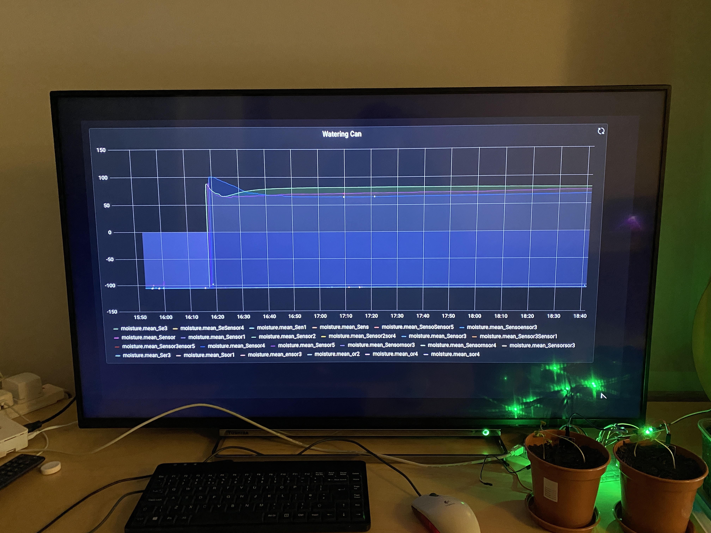
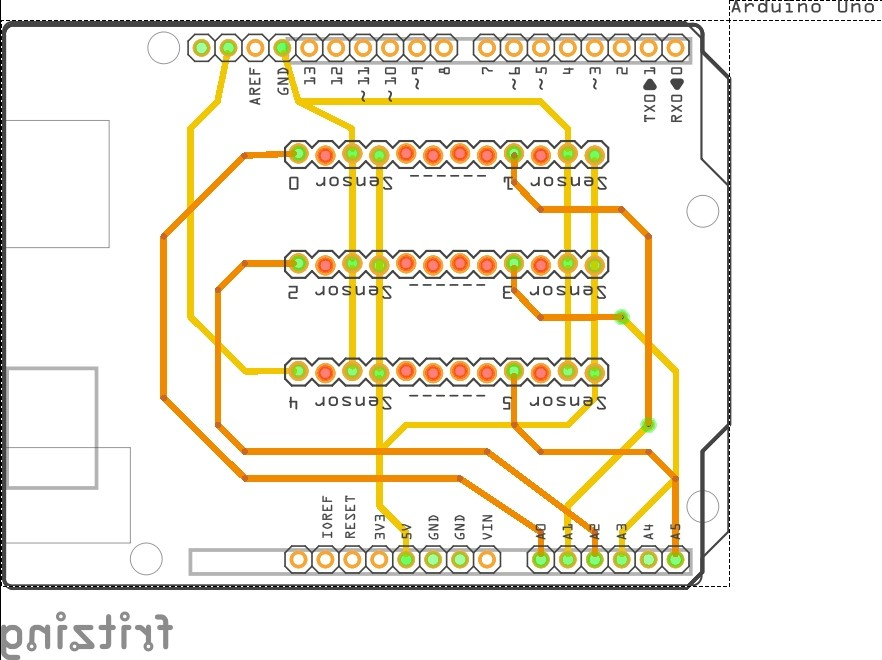

# WateringCan
Water Monitor
Aim: To learn and develop my coding knowledge through a project to automate the watering of indoor vegetable plants.

Using an arduino to collect data from 5 moisture sensors, format the data, and print serial. This serial is then read by a Raspberry Pi which is connected via USB to the Arduino, and commits the live data to an InfluxDB database using a python script. Using Grafana, I can then display my live readings from the Pi onto a monitor or TV (as seen below).

I have also used Fritzing to design a PCB arduino sheild, in order to relieve the set up of the breadboard and its jumper cables. Moving forward, I plan to order this self-designed part and install it, along with replace the sensors as they have already oxidized (dont buy cheap ones!) Finally, the next stage would be to move to automated watering, involving pump/valve control, and decision making using my data.

[embed]https://github.com/ArthurSkinner/WateringCan/blob/main/Watering_Can_Schematic_schem.pdf[/embed]
https://github.com/ArthurSkinner/WateringCan/blob/main/Watering_Can_Schematic_schem.pdf
